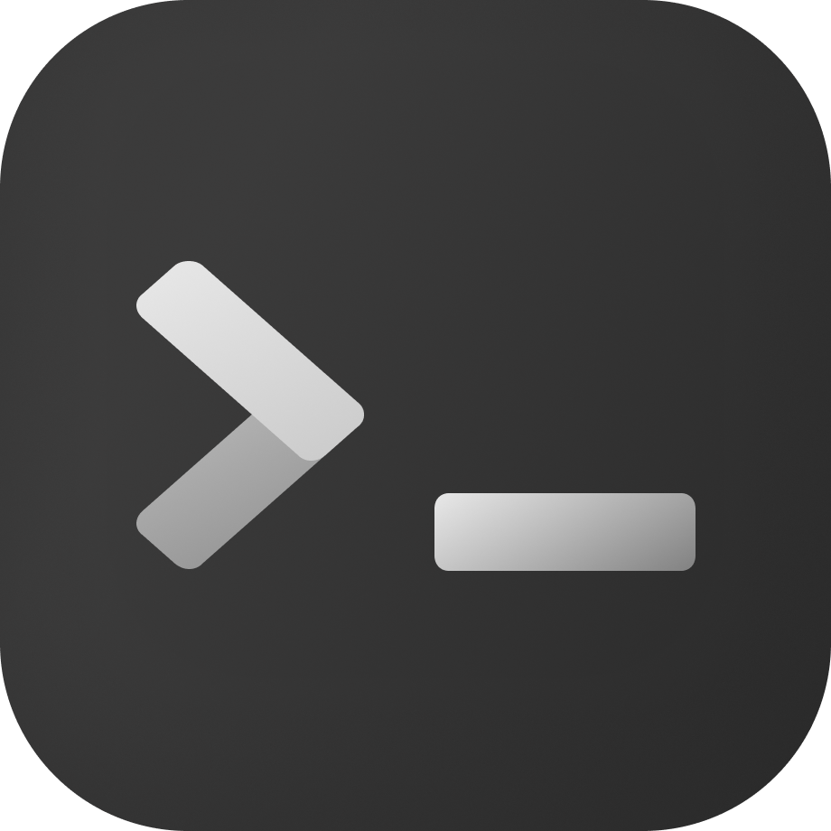

<p align="center">
  
</p>
<h1 align="center">Termac</h1>

<p align="center">
  Terminal macOS nativo e minimalista, feito em Swift com <a href="https://github.com/Lakr233/libghostty-spm">libghostty</a>.
</p>

<p align="center">
  
</p>

## ✨ Destaques

- **Shells reais** via PTY e renderização Metal do Ghostty
- **Abas com personalidade**: renomeie, fixe e lance **agentes de IA** com cor própria no chip da aba
- **Agentes IA manuais**: cadastre Nome + Comando + Cor nas configurações e execute no dropdown — boot direto, sem esperar a shell
- **Temas, fontes e zoom** do catálogo Ghostty, com tudo persistido em `~/.config/termac/config.yml`

Lista completa: [docs/FEATURES.md](docs/FEATURES.md).

## 📦 Instalação

**Homebrew (recomendado):**

```bash
brew trust --tap ThiagoAciole/termac
brew tap ThiagoAciole/termac
brew install --cask termac
```

O cask limpa o quarantine do Gatekeeper. Detalhes: [docs/HOMEBREW.md](docs/HOMEBREW.md).

**Manual:**

1. Baixe `Termac-macos.zip` da [última release](https://github.com/ThiagoAciole/termac/releases/latest).
2. Descompacte e mova o `Termac.app` para `/Applications` (ou `~/Applications`).
3. Na primeira abertura, se o macOS bloquear, veja [docs/TROUBLESHOOTING.md](docs/TROUBLESHOOTING.md).

## 🔐 Builds self-signed

Os builds são assinados com a identidade estável **Termac Self-Signed** (não é Apple Developer ID nem notarizado). Para validar, confira a Authority **e** o fingerprint SHA-256 do certificado (o CN sozinho é falsificável):

```bash
codesign -dv --verbose=4 Termac.app
# esperado: Authority=Termac Self-Signed
codesign --verify --verbose=4 Termac.app

codesign -d --extract-certificates=/tmp/termac-cert Termac.app
openssl x509 -inform DER -in /tmp/termac-cert0 -noout -fingerprint -sha256
# esperado: SHA256 Fingerprint=BD:34:10:13:1B:F1:D6:58:CD:0E:82:C6:58:5C:0A:B1:EC:30:C9:C8:F8:26:C9:85:61:4C:58:25:14:C5:EE:D4
rm -f /tmp/termac-cert*
```

Se o Gatekeeper reclamar na primeira abertura: botão direito no app → **Abrir** → **Abrir** (só uma vez), ou `xattr -dr com.apple.quarantine /caminho/Termac.app`.

Mais ajuda: [docs/TROUBLESHOOTING.md](docs/TROUBLESHOOTING.md) · Mantenedores: [docs/SIGNING.md](docs/SIGNING.md).

## 🛠 Requisitos e build

- macOS 15.6+
- Xcode 16+ (Swift 5 / SDK macOS)

```bash
git clone --recurse-submodules https://github.com/ThiagoAciole/termac.git
cd termac
open Termac.xcodeproj
```

Já clonou sem os submódulos? `git submodule update --init --recursive`.

Build e rode o scheme **Termac**. O App Sandbox fica **off** de propósito — o Ghostty precisa spawnar uma shell real (`.exec`). Para gerar o DMG assinado: `./Script/make-dmg.sh`.

## 🤖 Para IAs e contribuidores

O [AGENTS.md](AGENTS.md) concentra o guia operacional: comandos de build/teste, mapa de código, fluxo de agentes e invariantes do projeto.

## 📄 Licença

MIT
